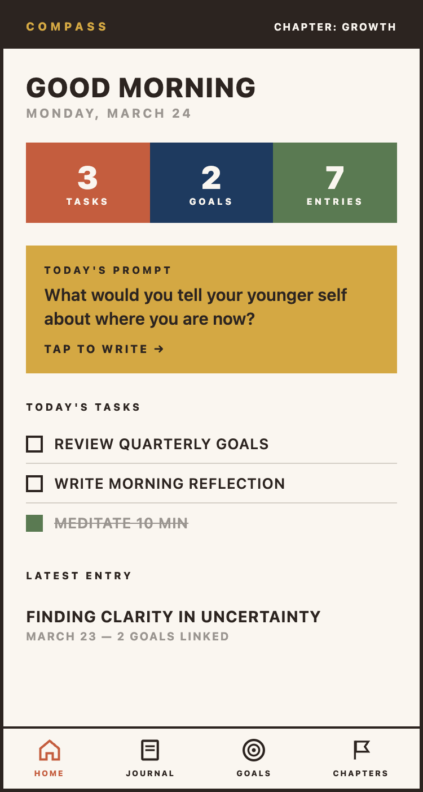
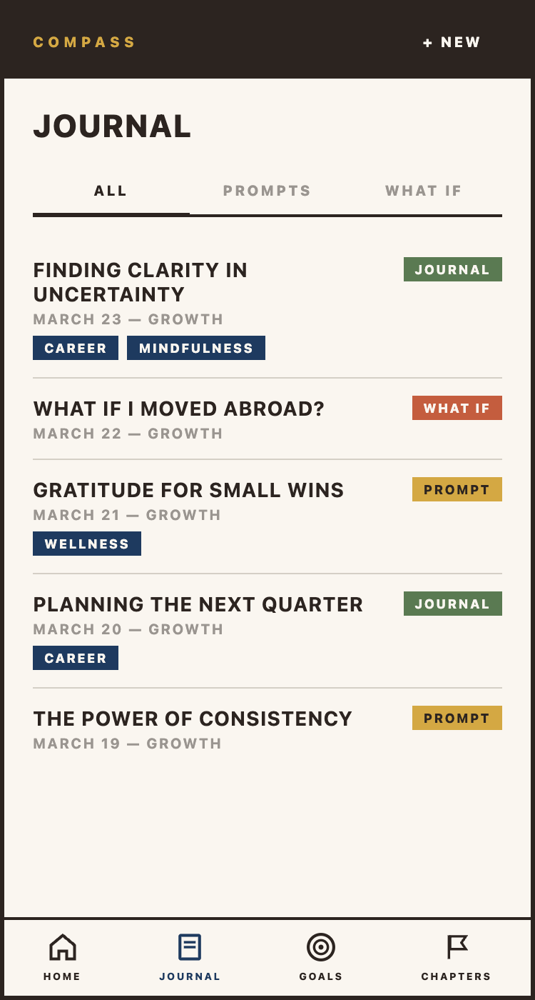
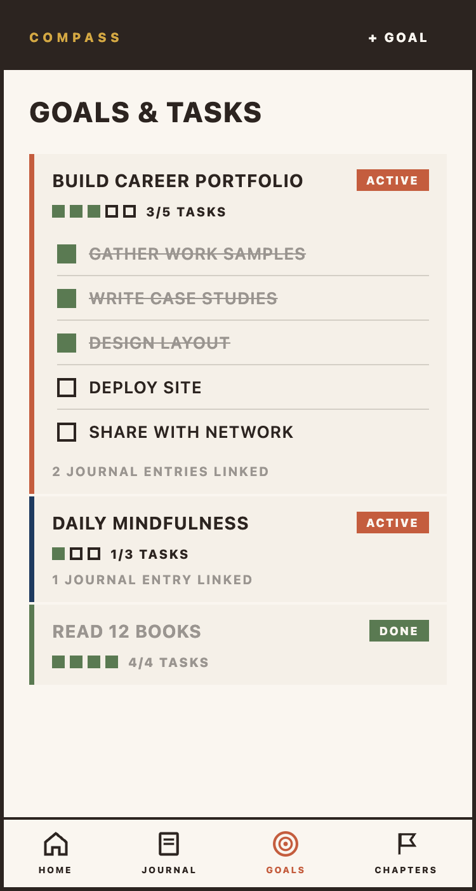
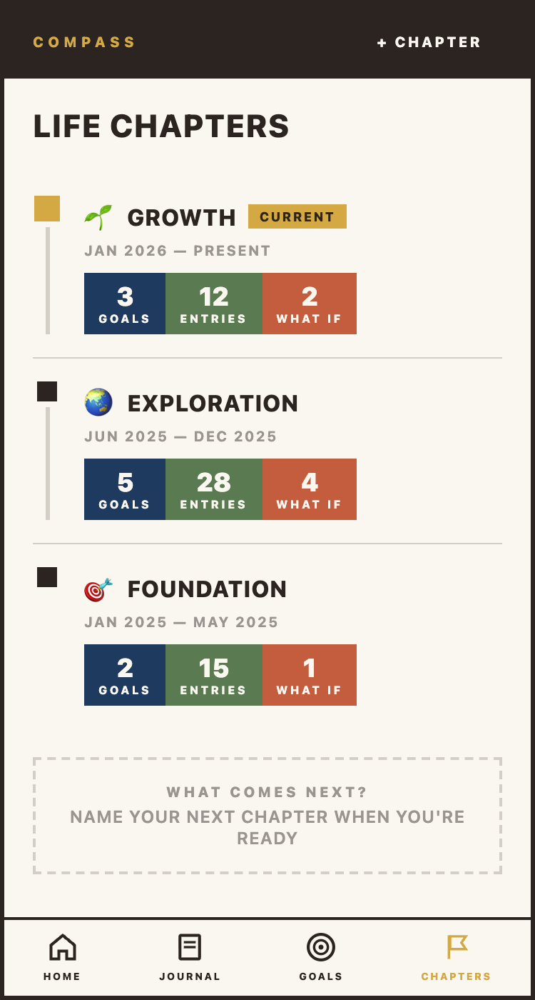

# Compass

Your life purpose & goal tracker.

Compass is a personal life tracking app that helps you organize your life through **chapters**, **goals**, **tasks**, and **journal entries**. It connects life phases with specific aspirations and daily reflections, giving you a structured way to map your life story.

The visual design is inspired by [Otto Neurath's Isotype](https://en.wikipedia.org/wiki/Isotype_(picture_language)) — bold geometric pictograms, flat colors, heavy borders, uppercase typography, and no rounded corners.

## Screenshots

<p align="center">
  
  
  
  
</p>

## Features

- **Life Chapters** — organize your life into distinct phases with a vertical timeline
- **Goals & Tasks** — hierarchical goals with progress pictograms and nested sub-goals
- **Journal** — rich text entries with three modes: free-form, guided prompts, and what-if scenarios
- **Daily Prompts** — curated reflection questions surfaced on your home dashboard
- **Goal Linking** — connect journal entries to specific goals for context
- **PWA** — installable on mobile with offline-capable home screen icon

## Tech Stack

| Layer | Technology |
|-------|-----------|
| Framework | [Next.js](https://nextjs.org) (App Router) |
| Language | TypeScript |
| Styling | Tailwind CSS |
| UI Components | shadcn/ui, Base UI |
| Rich Text | Tiptap |
| Database | Supabase (PostgreSQL) |
| Auth | Supabase Auth (Google OAuth) |
| Hosting | Vercel |

## Color Palette

| Color | Hex | Usage |
|-------|-----|-------|
| Cream | `#FAF6F0` | Background |
| Brown | `#2C2420` | Primary text, borders |
| Terracotta | `#C45D3E` | Tasks, active states |
| Navy | `#1E3A5F` | Goals, links |
| Gold | `#D4A843` | Prompts, chapters |
| Olive | `#5A7A52` | Journal, completed states |
| Muted | `#9A9590` | Secondary text |
| Border | `#D4CFC6` | Dividers |

## Getting Started

### Prerequisites

- Node.js 18+
- A [Supabase](https://supabase.com) project

### Setup

```bash
# Install dependencies
npm install

# Set up environment variables
cp .env.example .env.local
# Fill in your Supabase URL and anon key

# Run the development server
npm run dev
```

Open [http://localhost:3000](http://localhost:3000) to see the app.

## Project Structure

```
app/
  (app)/           # Authenticated routes
    page.tsx       # Home dashboard
    journal/       # Journal entries
    goals/         # Goals & tasks
    chapters/      # Life chapters
  (auth)/          # Login page
  api/             # API routes
components/
  home/            # Dashboard cards
  journal/         # Entry editor, tabs
  goals/           # Goal cards, task items
  chapters/        # Timeline, chapter forms
  nav/             # Mobile bottom bar + desktop sidebar
  ui/              # Shared primitives
lib/
  supabase/        # Client, server, types
```

## License

Private.
